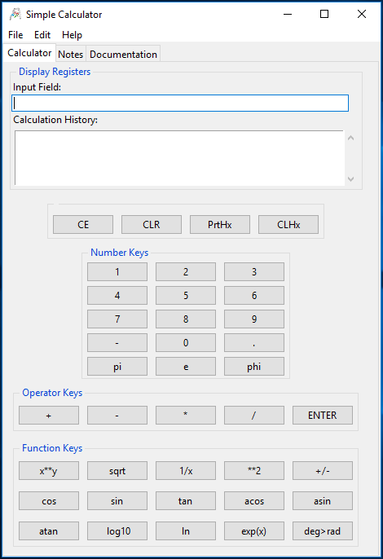

# SimpleCalc
A Simple Calculator project in python
  
This is a programming project in python to implement, with tkinter, a simple mathematical calculator. This was undertaken by me mainly as an exercise learning Tkinter, I decided to make it available for all to review and use if found helpful. Constructive comments welcome. Enjoy.

This is implemented with python 3.7 and is truly a work in progress. There is much that is not 'pythonic' I'm sure.

I have been growing in functionality as new operations are added. It will likely serve as a testbed as well for learning to programming from the numpy library. Plans are to implement a function graphing capability via mathplotlib as well a s some kind of (single variable) statistical calculator. I hope you follow a long and comment freely. After-all, this is first and foremost part of my learning experience.

I have tried to open my thinking processes to view by including mind maps, doodles and UML models as I develop and grow this application. 

The screenshot for Version 1.24 is below.

  

